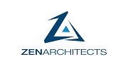

# Key Vault Acmebot

This application automates the issuance and renewal of ACME SSL/TLS certificates. The certificates are stored inside Azure Key Vault. Many Azure services such as Azure App Service, Application Gateway, CDN, etc. are able to import certificates directly from Key Vault.

## Links

- Documentation: [Key Vault Acmebot wiki](https://github.com/shibayan/keyvault-acmebot/wiki)
- Community: [GitHub Discussions](https://github.com/shibayan/keyvault-acmebot/discussions)

## Motivation

We have started to address the following requirements:

- Use the Azure Key Vault to store SSL/TLS certificates securely
- Centralize management of a large number of certificates using a single Key Vault
- Easy to deploy and configure solution
- Highly reliable implementation
- Ease of Monitoring (Application Insights, Webhook)

Key Vault Acmebot allows for secure and centralized management of ACME certificates.

## Feature Support

- Issuing certificates for Zone Apex, Wildcard and SANs (multiple domains)
- Dedicated dashboard for easy certificates management
- Automated certificate renewal
- ACME v2 compliants Certification Authorities
  - [Let's Encrypt](https://letsencrypt.org/)
  - [Buypass Go SSL](https://www.buypass.com/ssl/resources/acme-free-ssl)
  - [ZeroSSL](https://zerossl.com/features/acme/) (Requires EAB Credentials)
- Azure App Services (Web Apps / Functions / Containers, regardless of OS)
- Azure CDN / Front Door / Application Gateway v2 / etc

## Deployment

| Azure (Public) | Azure China | Azure Government |
| :---: | :---: | :---: |
|  |  |  |

Learn more at https://github.com/shibayan/keyvault-acmebot/wiki/Getting-Started

## Sponsors

Thank you for supporting our development. Are you interested in special support? [Become a Sponsor](https://github.com/sponsors/shibayan)

## Thanks

- [ACMESharp Core](https://github.com/PKISharp/ACMESharpCore) by @ebekker
- [Durable Functions](https://github.com/Azure/azure-functions-durable-extension) by @cgillum and contributors
- [DnsClient.NET](https://github.com/MichaCo/DnsClient.NET) by @MichaCo

## License

This project is licensed under the [Apache License 2.0](https://github.com/shibayan/keyvault-acmebot/blob/master/LICENSE)
