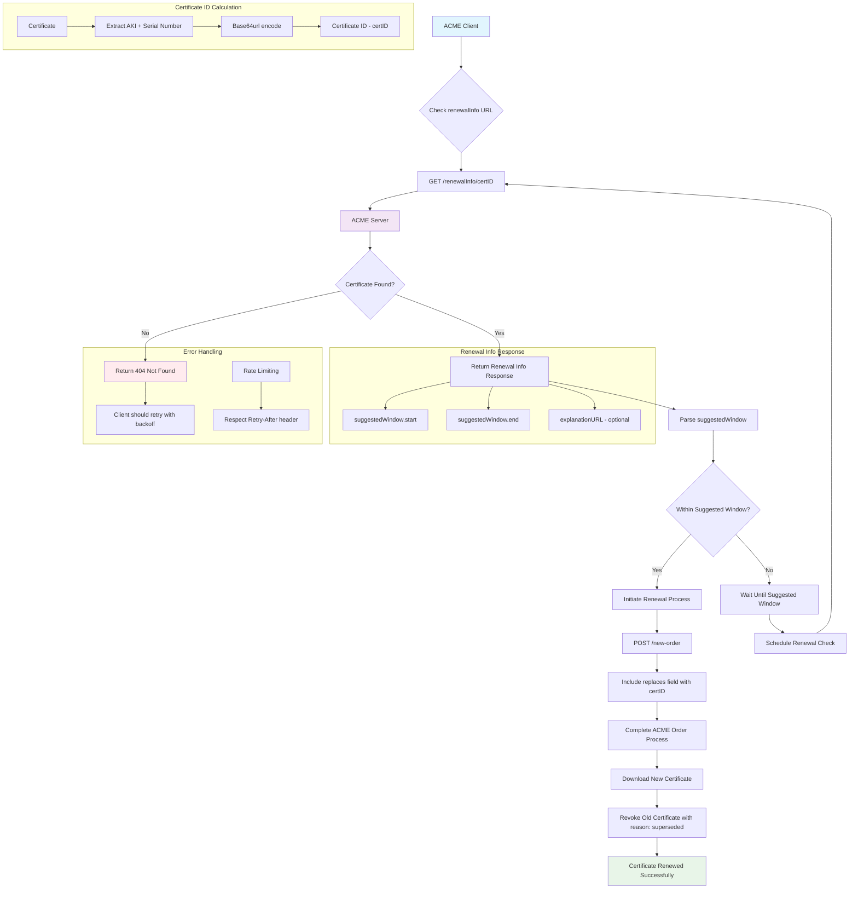

## ARI Spec

https://datatracker.ietf.org/doc/draft-ietf-acme-ari/

```mermaid
graph TD
    A[ACME Client] --> B{Check renewalInfo URL}
    B --> C[GET /renewalInfo/certID]
    C --> D[ACME Server]
    D --> E{Certificate Found?}
    
    E -->|Yes| F[Return Renewal Info Response]
    E -->|No| G[Return 404 Not Found]
    
    F --> H[Parse suggestedWindow]
    H --> I{Within Suggested Window?}
    
    I -->|Yes| J[Initiate Renewal Process]
    I -->|No| K[Wait Until Suggested Window]
    
    J --> L[POST /new-order]
    L --> M[Include replaces field with certID]
    M --> N[Complete ACME Order Process]
    N --> O[Download New Certificate]
    
    O --> P[Revoke Old Certificate with reason: superseded]
    P --> Q[Certificate Renewed Successfully]
    
    K --> R[Schedule Renewal Check]
    R --> C
    
    subgraph "Renewal Info Response"
        F --> F1[suggestedWindow.start]
        F --> F2[suggestedWindow.end]
        F --> F3[explanationURL - optional]
    end
    
    subgraph "Certificate ID Calculation"
        S[Certificate] --> T[Extract AKI + Serial Number]
        T --> U[Base64url encode]
        U --> V[Certificate ID - certID]
    end
    
    subgraph "Error Handling"
        G --> W[Client should retry with backoff]
        X[Rate Limiting] --> Y[Respect Retry-After header]
    end
    
    style A fill:#e1f5fe
    style D fill:#f3e5f5
    style Q fill:#e8f5e8
    style G fill:#ffebee
```